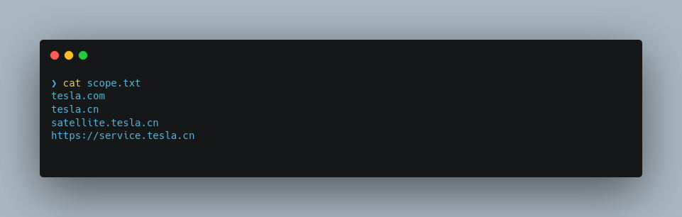
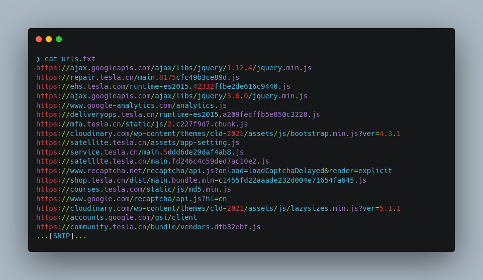
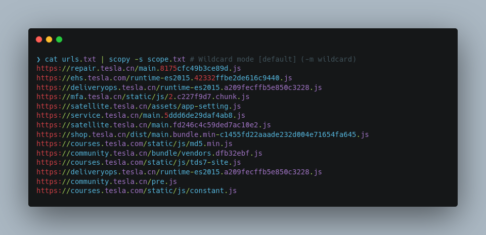
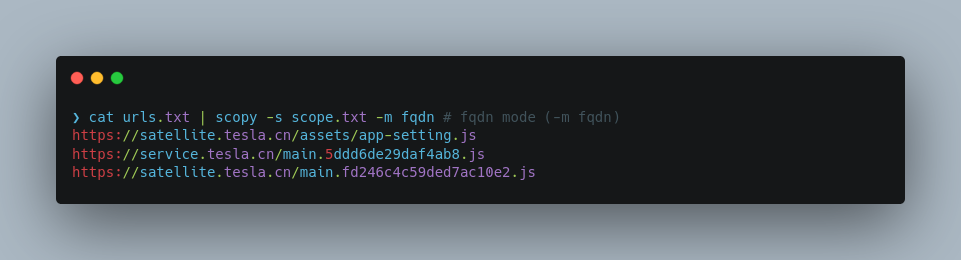

# Scopy

Scopy is a Python script for filtering URLs by matching against a scope file. It supports reading input from a file or standard input, and allows the user to specify the mode of operation (wildcard or FQDN).

# Installation

Scopy requires Python 3 and the `tldextract` library. Follow these commands to set up scopy in your system.

```bash
pip install tldextract
git clone https://github.com/xplo1t-sec/scopy
chmod +x scopy.py
cp scopy.py /usr/local/bin/scopy
```
Note: If you're on the latest Kali/Debian, you might have issues with pip install. Try the following in this case:
```bash
apt install python3-tldextract
```

# Usage

```bash
usage: scopy.py [-h] -s SCOPE [-i INPUT] [-m MODE]

Filter URLs that match your scope file.

options:
  -h, --help            show this help message and exit
  -s SCOPE, --scope SCOPE
                        Scope for the URLs
  -i INPUT, --input INPUT
                        Input file containing URLs
  -m MODE, --mode MODE  Mode to run in (wildcard or fqdn)
```

To use Scopy, you need to provide a scope file (-s) and a mode of operation (-m). You can provide the input URLs as an input file (-i) or from stdin.
A scope file can contain domains, subdomains or even urls:



You can pass the url file as an argument or pipe scopy with another command to read the urls from stdin. This file will contain the urls of your target (Eg: all the js files present in your target).



Scopy runs on two modes:
- wildcard
- fqdn

By default, it will match all the urls that belongs to the scope including it's subdomains. You can tell scopy to match based on fully qualified domain name (FQDN) by specifying the mode as `fqdn`.

# Examples

### Default mode (-m wildcard)


### FQDN mode (-m fqdn)


### Take input from file (-i urls.txt)


### Piping it with another program


# Acknowledgments

Scopy is built using the [tldextract](https://github.com/john-kurkowski/tldextract) library.

# Contributing

If you face any issues or have any suggestions, feel free to create an issue. PRs are greatly appreciated.